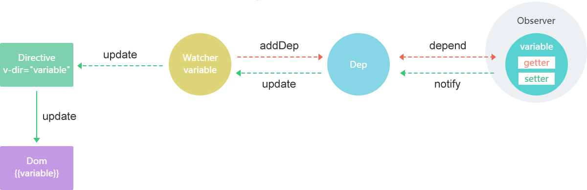

# 包含的内容

Agile CE框架由几部分组件共同构成：Compiler组件、Parser组件、Observer组件、Watcher组件、Updater组件、JQlite组件和MVVM组件。

其原理图为：



JQLite组件是串联各个组件的桥梁，将MVVM的操作jQuery化。

比如：

```javascript

var json = {}；
$('#container').render(json);

```

其含义是将json数据与界面中id为container的元素进行双向数据绑定，该元素中需要包含Agile CE的指令，并且指令绑定的数据必须是json对象内的。

Compiler和Parser组件用于解析DOM上的指令。

Observer组件用观察绑定数据的变化。

Watcher组件存储观察者与数据的关系。

Updater组件用于将数据的变化更新到DOM上。

MVVM组件用于暴露入口和API给JQLite调用

目前提供接口的API主要是JQLite和Parser组件。