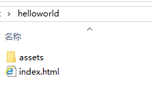

# 第一次开发

本节内容将开启您的第一次开发之旅，让您体会使用Agile CE框架开发的基本模式。

本节内容均以HTML为例进行说明。

<h2 id="cid_0">创建工程目录</h2>

首先创建一个应用工程目录，我们叫helloworld。

在helloworld目录创建一个assets目录，并继续在assets目录下创建js目录。

将ace框架的agile.ce.browser.min.js文件拷贝进此目录。


<h2 id="cid_1">创建入口HTML文件</h2>

然后在工程目录下创建一个index.html文件，并将ace的文件引入页面中，代码如下：

```html
<!-- HTML5文件 -->
<!DOCTYPE html>
<html>
	<head>
		<meta charset="utf-8"/>
		<meta name="viewport" content="width=device-width, initial-scale=1.0, user-scalable=0, minimum-scale=1.0, maximum-scale=1.0">
		<title>Agile CE示例</title>
		<script src="assets/js/agile.ce.browser.js" charset="UTF-8"></script>
	</head>
	<body>

	</body>
</html>
```

截止目前目录结构如下图：




<h2 id="cid_2">添加渲染View</h2>

在body中添加一个渲染View，此View使用ace的指令绑定数据，代码如下：

```html
<!-- 为div设置id属性，作为JS中的唯一选择器 -->
<div id="view">
<input type="text" v-model="welcome" prompt="请输入你的名字"/>
<p>hello {{welcome}}</p>
</div>
```

<h2 id="cid_3">绑定渲染数据对象</h2>

在head区域添加一段JS代码为View绑定渲染数据对象

```javascript
//定义渲染数据对象
var obj = {
	welcome : 'world'
};

//为View绑定数据对象
$('#view').render(obj);
```

经过上面的步骤我们就完成了基本的ace框架的基本使用，里面用到了<code>v-model</code>指令和<code>v-text</code>指令

代码的运行效果是当在浏览器内输入任意字符就会在下面显示“hello+输入的字符”的内容。